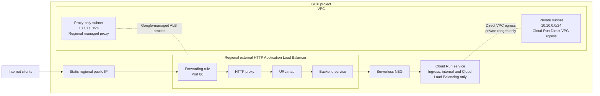

# SimpleTimeService

SimpleTimeService is a minimal Go web service that returns the current UTC time and the visitor's IP address as JSON. This repository builds the application as a small, non-root container and deploys it to a Terraform-managed Google Cloud project.

## Architecture

The deployment uses a regional external Application Load Balancer in front of a Cloud Run service:



Terraform creates a custom VPC with two regional subnets in `us-central1`:

- `cloud-run-subnet` provides private addresses for Cloud Run Direct VPC egress.
- `lb-proxy-subnet` is reserved for Google-managed regional load-balancer proxies.

GCP subnets span all zones in their region, so separate per-zone subnets are not needed for availability. The Cloud Run default URL is disabled and its ingress setting accepts external traffic only through Cloud Load Balancing. A serverless NEG uses Google-managed routing, so no VPC firewall rule is required between the load balancer and Cloud Run.

This design keeps the service and networking operationally small, scales the application to zero when idle, and gives the public endpoint a stable IP.

I've decided to not use DNS for this project because:

- it's very hard to generate the domain name programatically without collisions
- usually requires to reserve the domain for at least a year
- it's expensive for a take-home challenge
- it's not part of the acceptance criteria

Useful docs:

- https://docs.cloud.google.com/load-balancing/docs/https/setting-up-reg-ext-https-serverless
- https://docs.cloud.google.com/run/docs/securing/private-networking

## Prerequisites

- [Terraform](https://developer.hashicorp.com/terraform/install) 1.10 or newer
- [Google Cloud CLI](https://cloud.google.com/sdk/docs/install)
- [Docker](https://docs.docker.com/engine/install/) with Buildx to publish the application image
- A Google Cloud billing account
- Bootstrap permissions:
  - Project Creator (`roles/resourcemanager.projectCreator`)
  - Billing Account User (`roles/billing.user`) on the billing account

The public image must exist before Terraform deploys Cloud Run. I've already made the necessary release with:

```bash
docker login
make publish TAG=v1.0.0
```

Alternatively, use the manually triggered **Build and publish Docker image**
GitHub Actions workflow. Configure these repository secrets first:

- `DOCKERHUB_USERNAME`: Docker Hub username with access to the repository.
- `DOCKERHUB_TOKEN`: Docker Hub access token with permission to push images.

Run the workflow from the GitHub Actions page and provide the desired
`image_tag`, such as `v1.0.0`. It publishes that exact tag for `linux/amd64`,
`linux/arm64`, and `linux/arm/v7` to
`agustinramirodiaz/simpletimeservice`. The workflow only runs through manual
dispatch; repository pushes and Git tags do not trigger it.

## Authenticate to Google Cloud

Authenticate the Google Cloud CLI, then create Application Default Credentials for the Google provider:

```bash
gcloud auth login
gcloud auth application-default login
```

By default, Terraform selects the first open billing account available to the authenticated `gcloud` identity. You can inspect which accounts are available:

```bash
gcloud billing accounts list
```

No billing variable is required for the default path. To select a different account explicitly, use either of these overrides:

1. Configure with a file

   Copy the example file

   ```bash
   cp terraform/my.auto.tfvars.example terraform/my.auto.tfvars
   ```

   Then edit `terraform/my.auto.tfvars` with the desired account ID.

2. Configure with environment variables

   Export the chosen account ID. Environment variables keep account-specific data out of version control:

   ```bash
   export TF_VAR_billing_account_id="000000-000000-000000"
   ```

## Deploy

Run Terraform from the `terraform` directory:

```bash
cd terraform
terraform init
terraform plan
terraform apply
```

The first apply creates a project named `agustinramirodiaz-<random-hex>`, links it to the billing account, enables the required APIs, and deploys all networking and application resources. Internal resources use stable descriptive names; only the globally unique project ID has a random suffix.

Test the service through the load balancer:

```bash
curl "$(terraform output -raw service_url)"
```

Expected response shape:

```json
{
  "timestamp": "2026-08-01T12:00:00Z",
  "ip": "203.0.113.10"
}
```

Load-balancer provisioning can take several minutes. If the first request fails, wait briefly and retry.

Useful outputs are available with:

```bash
terraform output
```

## Clean up

Destroy all resources when finished to avoid ongoing charges:

```bash
terraform destroy
```

Terraform destroys the child resources and then schedules the entire project for deletion. Project deletion is initially recoverable in Google Cloud, so confirm the project is shut down and no billable resources remain.

## Local development

Run the Go service directly:

```bash
cd app
go test ./...
go run .
```

In another terminal:

```bash
curl http://localhost:8080/
```

Build or run the local container from the repository root:

```bash
make build
make run
make build-and-run
```
