# SimpleTimeService

SimpleTimeService is a minimal Go web service that returns the current UTC time and the visitor's IP address as JSON. This repository builds the application as a small, non-root container and deploys it to a Terraform-managed Google Cloud project.

This repo is the solution to the [tech exercise](EXERCISE.md) of Particle41

## Architecture

The deployment uses a regional external Application Load Balancer in front of a Cloud Run service:

```mermaid
flowchart LR
  client[Internet clients]

  subgraph project["GCP project"]
    subgraph vpc["VPC"]
      proxy_subnet["Proxy-only subnet<br/>10.10.1.0/24<br/>Regional managed proxy"]
    end

    ip["Static regional public IP"]

    subgraph alb["Regional external HTTP Application Load Balancer"]
      forwarding_rule["Forwarding rule<br/>Port 80"]
      http_proxy["HTTP proxy"]
      url_map["URL map"]
      backend["Backend service"]
    end

    neg["Serverless NEG"]
    subgraph cloud_run["Cloud Run service<br/>Ingress: internal and Cloud Load Balancing only"]
      app["App container<br/>SimpleTimeService<br/>:8080"]
      otel["Sidecar container<br/>OpenTelemetry Collector<br/>OTLP :4317/:4318"]
      app -- "OTLP metrics over localhost" --> otel
    end

    observability["Google Cloud Observability<br/>Managed Service for Prometheus"]
    dashboard["Cloud Monitoring dashboard<br/>RED metrics"]
    secret["Secret Manager<br/>Collector config"]
  end

  client --> ip --> forwarding_rule --> http_proxy --> url_map --> backend --> neg
  neg -- "Google-managed serverless routing" --> app
  proxy_subnet -. "Google-managed ALB proxies" .- alb
  secret -. "mounted at startup" .-> otel
  otel -- "batched metrics export" --> observability
  observability --> dashboard
```



Terraform creates a custom VPC with `lb-proxy-subnet`, a regional proxy-only
subnet reserved for Google-managed load-balancer proxies.

Cloud Run and the serverless NEG are managed Google Cloud resources rather than
VMs placed inside a VPC subnet. The backend hop uses private Google-managed
routing outside the VPC firewall path. Because this service does not initiate
connections to private VPC resources, it does not need Direct VPC egress or a
workload subnet. The Cloud Run default URL is disabled and its ingress setting
accepts external traffic only through Cloud Load Balancing, so the load
balancer remains the only public path to the container.

The Cloud Run revision uses two containers in the same service instance. The
`app` container handles requests, records a small set of OpenTelemetry metrics,
and sends them to the `otel-collector` sidecar over localhost. The sidecar uses
Google's OpenTelemetry Collector image, reads its configuration from Secret
Manager, batches/enriches metrics with Cloud Run metadata, and exports them to
Google Cloud Observability.

Terraform also provisions a Cloud Monitoring dashboard for request rate,
HTTP errors, latency percentiles, routes, and response status codes.

This design keeps the service and networking operationally small, scales the application to zero when idle, and gives the public endpoint a stable IP.

I've decided to not use DNS for this project because:

- it's very hard to generate the domain name programatically without collisions
- usually requires to reserve the domain for at least a year
- it's expensive for a take-home challenge
- it's not part of the acceptance criteria

Useful docs:

- https://docs.cloud.google.com/load-balancing/docs/https/setting-up-reg-ext-https-serverless
- https://docs.cloud.google.com/run/docs/securing/private-networking
- https://docs.cloud.google.com/stackdriver/docs/instrumentation/opentelemetry-collector-cloud-run

## Prerequisites

- [Terraform](https://developer.hashicorp.com/terraform/install) 1.10 or newer
- [Google Cloud CLI](https://cloud.google.com/sdk/docs/install)
- [Docker](https://docs.docker.com/engine/install/) with Buildx to publish the application image
- A Google Cloud billing account
- Bootstrap permissions:
  - Project Creator (`roles/resourcemanager.projectCreator`)
  - Billing Account User (`roles/billing.user`) on the billing account

The public image must exist before Terraform deploys Cloud Run. Publish a
release before updating `terraform/terraform.tfvars` with the new image digest:

```bash
docker login
make publish TAG=v1.0.6
```

Alternatively, use the manually triggered **Build and publish Docker image**
GitHub Actions workflow. Configure these repository secrets first:

- `DOCKERHUB_USERNAME`: Docker Hub username with access to the repository.
- `DOCKERHUB_TOKEN`: Docker Hub access token with permission to push images.

Run the workflow from the GitHub Actions page and provide the desired
`image_tag`, such as `v1.0.0`. It publishes that exact tag for `linux/amd64`,
`linux/arm64`, and `linux/arm/v7` to
`agustinramirodiaz/simpletimeservice`. The workflow only runs through manual
dispatch; repository pushes and Git tags do not trigger it.

## Authenticate to Google Cloud

Authenticate the Google Cloud CLI, then create Application Default Credentials for the Google provider:

```bash
gcloud auth login
gcloud auth application-default login
```

By default, Terraform selects the first open billing account available to the authenticated `gcloud` identity. You can inspect which accounts are available:

```bash
gcloud billing accounts list
```

No billing variable is required for the default path. To select a different account explicitly, use either of these overrides:

1. Configure with a file

   Copy the example file

   ```bash
   cp terraform/my.auto.tfvars.example terraform/my.auto.tfvars
   ```

   Then edit `terraform/my.auto.tfvars` with the desired account ID.

2. Configure with environment variables

   Export the chosen account ID. Environment variables keep account-specific data out of version control:

   ```bash
   export TF_VAR_billing_account_id="000000-000000-000000"
   ```

## Deploy

Run Terraform from the `terraform` directory:

```bash
cd terraform
terraform init
terraform plan -out=simple-time-service.tfplan
```

Review the saved plan before applying it:

```bash
terraform show simple-time-service.tfplan
```

Then apply that exact plan:

```bash
terraform apply simple-time-service.tfplan
```

Saving the plan ensures that `terraform apply` executes the same changes that
were reviewed, instead of recalculating a potentially different plan. If the
configuration, variables, provider selections, credentials, or existing
infrastructure change after the plan is created, discard it and generate a new
one before applying.

Saved plan files can contain sensitive configuration and state data. Keep them
local, do not share or commit them, and remove them when they are no longer
needed. Files ending in `.tfplan` are already excluded by this repository's
`.gitignore`.

The first apply creates a project named `agustinramirodiaz-<random-hex>`, links it to the billing account, enables the required APIs, and deploys all networking and application resources. Internal resources use stable descriptive names; only the globally unique project ID has a random suffix.

Test the service through the load balancer:

```bash
curl "$(terraform output -raw service_url)"
```

Expected response shape:

```json
{
  "timestamp": "2026-08-01T12:00:00Z",
  "ip": "203.0.113.10"
}
```

Load-balancer provisioning can take several minutes. If the first request fails, wait briefly and retry.

Useful outputs are available with:

```bash
terraform output
```

## Advanced

### Select the Terraform state backend

The committed Terraform configuration intentionally has no `backend` block,
so Terraform uses the local backend and stores state in
`terraform/terraform.tfstate` by default. From the repository root, initialize
or switch back to local state with:

```bash
make terraform-init
```

To use an existing Google Cloud Storage bucket instead, provide its name to the
GCS initialization target:

```bash
make terraform-init-gcs \
  GCS_BUCKET=my-terraform-state-bucket \
  GCS_PREFIX=env/dev
```

`GCS_PREFIX` is optional and defaults to `simple-time-service`. The command
generates `terraform/backend_override.tf` immediately before initialization:

```hcl
terraform {
  backend "gcs" {
    bucket = "my-terraform-state-bucket"
    prefix = "env/dev"
  }
}
```

The generated file is ignored by Git. Both initialization commands use
`terraform init -migrate-state`, so Terraform can copy existing state when you
switch between local and GCS backends. Review and confirm any migration prompt;
do not treat a newly empty state as interchangeable with the existing state.

For non-interactive initialization after the backend and state migration are
already established, pass additional initialization flags explicitly:

```bash
make terraform-init-gcs \
  GCS_BUCKET=my-terraform-state-bucket \
  GCS_PREFIX=env/dev \
  TF_INIT_FLAGS="-input=false"
```

The GCS bucket must exist before `terraform init`; it cannot be created by this
same root configuration because Terraform initializes the backend before it
creates resources. The authenticated identity also needs object access to the
bucket. Enable Object Versioning on the bucket so previous state versions can
be recovered after accidental deletion or corruption.

## Clean up

The project lifecycle guard intentionally blocks a normal destroy. To remove
the deployment, first delete `prevent_destroy = true` from the project resource
in a reviewed change, run and inspect a destruction plan, and then destroy all
resources to avoid ongoing charges:

```bash
terraform destroy
```

Terraform destroys the child resources and then schedules the entire project for deletion. Project deletion is initially recoverable in Google Cloud, so confirm the project is shut down and no billable resources remain.

## Contributing

See [Contributing.md](Contributing.md) for local development and automated check instructions.
